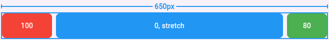

# stretch_wrap

A Flutter widget that wraps children into multiple rows and stretches designated children to fill the remaining space in each row.

## Features

- Wraps widgets into multiple rows, like Flutter's built-in `Wrap`.
- Stretches designated children or all children within each row to fill remaining space.
- Supports multiple stretched children in a row with different stretch ratios.
- Configurable spacing between children and rows.
- Cross-axis alignment control (start, center, end) for children within each row.
- Run alignment options (start, center, end, spaceBetween, spaceAround) for positioning children when there's remaining space.

## Usage

Wrap your widgets with `StretchWrap`. Use `Stretch` to mark which children should expand to fill the remaining space:

```dart
StretchWrap(
  spacing: 8,  // Space between children
  runSpacing: 16,  // Space between rows
  children: [
    Container(width: 100, height: 50, color: Colors.red),
    Stretch(  // This will fill available space, minimum width is 50
      child: Container(width: 50, height: 50, color: Colors.blue),
    ),
    Container(width: 80, height: 50, color: Colors.green),
  ],
)
```

### Multiple stretched children

When multiple children in the same row are wrapped with `Stretch`, they share the remaining space proportionally based on their `flex` factor:

```dart
StretchWrap(
  spacing: 8,
  children: [
    Container(width: 100),
    Stretch(  // Gets 1/3 of remaining space (width 0 prevents it from taking a whole row)
      child: Container(color: Colors.blue, width: 0),
    ),
    Stretch(  // Gets 2/3 of remaining space (width 0 prevents it from taking a whole row)
      flex: 2,
      child: Container(color: Colors.green, width: 0),
    ),
  ],
)
```

### How it works

1. First, children are measured and arranged into rows.
2. For each row, any remaining space is divided among `Stretch` children, or all children if it is configured to auto-stretch.
3. If a row has multiple stretched children, space is divided according to their `flex` values.
4. Each stretched child is then resized to its calculated width.

## Examples

See the [example](example) folder for a complete sample app.

### Basic Usage

Single stretched child between fixed-width children



### Multiple Stretched Children

Shows how flex values affect space distribution between multiple stretched children in the same row.


### Multiple Rows

Demonstrates wrapping behavior with runSpacing when children exceed the available width.


### Mixed Content

Mix of text, buttons, and other widgets showing real-world usage scenarios.


### Real-world Example

Tag list with "Add Tag" button, where each tag is stretched so all rows are of equal width.


### Alignment & AutoStretch

Demonstrates the alignment and autoStretch parameters for controlling how children are positioned and which children are automatically stretched.


### Cross Axis Alignment

Shows how children align within each run using crossAxisAlignment parameter (start, center, end).


